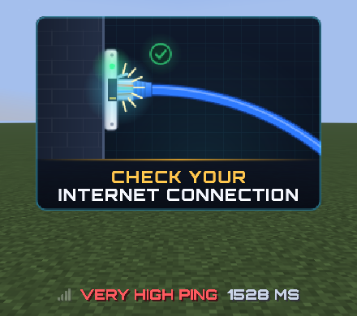
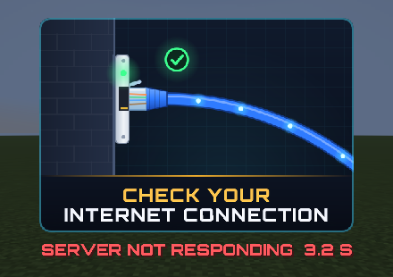

# PingGuard

Fabric-мод для сервера Minecraft **26.3**: предупреждает игрока о плохом соединении.

| Пинг | Что видит игрок |
|---|---|
| ≥ 500 мс | `POOR CONNECTION · 734 MS` (жёлтый) |
| ≥ 700 мс | то же, красным |
| ≥ 1000 мс **или сервер перестал отвечать** | мини-видео: Ethernet-кабель вставляют в розетку и выдёргивают, надпись **CHECK YOUR INTERNET CONNECTION** (шрифт Orbitron) |

Пороги настраиваются в `config/pingguard.json`.

<p align="center"></p>

| Ванильный клиент (ресурс-пак) | Клиент с модом |
|---|---|
|  |  |
|  |  |

Скриншоты сняты автоматическими тестами в CI: настоящий клиент 26.3 подключается к выделенному серверу с модом.

## Кто что видит

* **Клиент с Fabric и PingGuard** рисует всё сам: плашку слева сверху и карточку с видео по центру. Таймаут «сервер не отвечает» клиент считает сам.
* **Ванильный клиент или Fabric без PingGuard** получает ресурс-пак (сервер предлагает его при входе). Предупреждения приходят через action bar и title, видео собрано из глифов шрифта, анимирует его шейдер пака.
* **Тот, кто отказался от пака**, видит обычный текст: `⚠ Poor connection 734 ms` и заголовок `CHECK YOUR / INTERNET CONNECTION`.

### Как ванильный клиент узнаёт, что сервер «умер»

Если сервер не отвечает, отправить игроку ничего нельзя, поэтому карточка заранее висит в слоте title невидимой:

* сервер шлёт title с fade-in 510 тиков и каждые 0,5 с перезапускает таймер (крошечный пакет `SetTitlesAnimation`), поэтому альфа заголовка не поднимается выше ~5/255;
* шейдер `text.vsh` из пака прячет глифы с маркерным цветом `#FE50xx`, пока альфа меньше 11;
* если пакеты перестали приходить, альфа растёт (+1 каждые 2 тика), примерно через 1,1 с карточка появляется. Альфа служит часами: по ней шейдер выбирает кадр анимации (10 кадров/с).

При пинге ≥ 1000 мс, пока сервер ещё отвечает, карточку включает сервер (маркер `#FE51xx`, часы на fade-out).

Если другой плагин, команда `/title` или мод показывают свой title, PingGuard это замечает: возвращает стандартные тайминги и не трогает слот, пока чужой заголовок на экране. Исключение — критический пинг. Отключить «мёртвую руку» можно через `deadManSwitch: false`.

## Ресурс-пак

Пак лежит внутри jar, и PingGuard **сам раздаёт его по HTTP на игровом порту** (`http://<адрес, который ввёл игрок>/pingguard/<sha1>.zip`). Отдельный порт пробрасывать не нужно.

* Если адрес определяется неправильно (прокси, SRV-записи), укажите `publicAddress`, например `"93.184.216.34:25565"`.
* Чтобы хостить пак в другом месте, положите прямую ссылку в `resourcePackUrl`, а SHA-1 в `resourcePackSha1`. Файл `PingGuard-ResourcePack-*.zip` собирается рядом с jar.
* Свой пак можно подложить в `config/pingguard/pack.zip` (а потом `/pingguard reload`).

## Команды (уровень оператора 2)

```
/pingguard status                      пинг, уровень и тип клиента у всех игроков
/pingguard simulate <игрок> <мс>       добавить фейковый пинг (0 = выкл) — проверить плашку и видео
/pingguard freeze <игрок> <сек>        перестать слать игроку пакеты PingGuard (имитация «сервер не отвечает»)
/pingguard repack <игрок>              ещё раз предложить ресурс-пак
/pingguard reload                      перечитать конфиг и пак
```

## Конфиг `config/pingguard.json`

| Ключ | По умолчанию | |
|---|---|---|
| `poorPingMs` | 500 | жёлтое предупреждение |
| `badPingMs` | 700 | красное предупреждение |
| `criticalPingMs` | 1000 | видео |
| `recoverMs` | 2000 | сколько пинг должен держаться нормальным, чтобы предупреждение исчезло |
| `pingIntervalTicks` | 10 | как часто мерить пинг |
| `joinGraceMs` | 6000 | тишина после входа (подгрузка чанков) |
| `showPingNumber` | true | показывать число |
| `deadManSwitch` | true | невидимая карточка в слоте title (см. выше) |
| `sendResourcePack` / `requireResourcePack` | true / false | предлагать пак / кикать при отказе |
| `resourcePackUrl`, `resourcePackSha1`, `publicAddress`, `builtInHttp` | | хостинг пака |

## Тесты

`src/gametest` — клиентские гейм-тесты Fabric. Они запускают клиент, сначала проверяют HUD мода в одиночной игре, затем подключаются к выделенному серверу как ванильный клиент: принимают пак (скачивается с игрового порта), включают `simulate`/`freeze` и снимают скриншоты каждого состояния. В CI скриншоты можно скачать артефактом `gametest-screenshots`.

```
./gradlew runClientGameTest
```

## Сборка

```
./gradlew build
```

Нужен JDK 25. На выходе `build/libs/pingguard-1.0.0.jar` (кладётся в `mods/` сервера, по желанию и клиентам) и `PingGuard-ResourcePack-1.0.0.zip`.

Картинки, шрифтовые JSON, шейдер и `CardLayout.java` генерирует `tools/gen_assets.py` (нужны pycairo, Pillow, fontTools):

```
python3 tools/gen_assets.py
```

Шрифт Orbitron распространяется под SIL OFL 1.1 (`tools/fonts/OFL.txt`).
